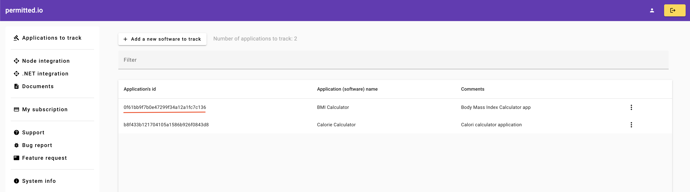
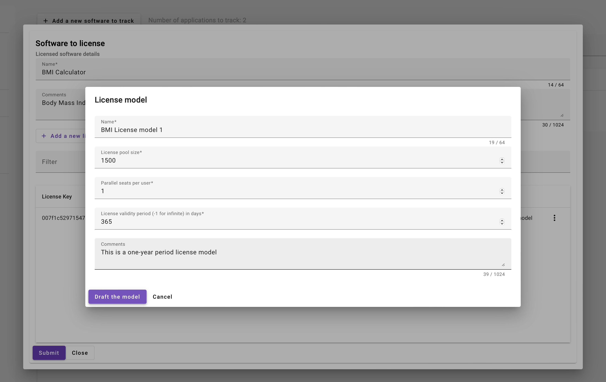
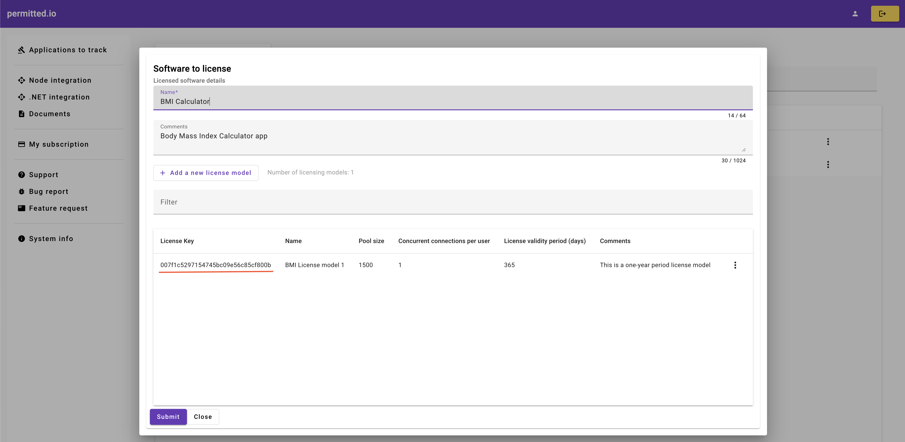

# permitted.io's .NET SDK

## Objectives

The goal of releasing this .NET NuGet package or library is to enable the permitted.io floating licensing system to integrate with your licensed software with no complex programming efforts.

## Integration Process

The integration process is relatively straightforward and encompasses the following key steps:

### Application Registration for Licensing

The initial step in utilizing the permitted.io floating licensing system is to create a profile within the system for the application or software intended for licensing. The designated admin portal streamlines this process, as illustrated in the screenshot. It is essential to note down the application ID (highlighted with a red line) for use within the SDK.



### Definition of the License Model Associated with the Application

Subsequent to the application registration, the following step involves defining a license model integrated with user connection tracking rules. Several parameters are necessary to define this model:

* Name: A user-friendly label for the license model.
* License pool size: Total count of users eligible for simultaneous licensing.
* Concurrent seats per user: The maximum number of simultaneous sessions per user.
* License validity period in days: Duration of a user's valid license since their initial connection.

The UI elements captured in the screenshot facilitate the collection of these parameters:



After saving the license model, a license key is generated, as demonstrated in the following screenshot, for use within the SDK:



> permitted.io provides an advantage by allowing the definition of multiple license models for your software or application.

### Association of User IDs with the License Model

To link your system's user IDs with the defined license model, submission of these IDs to our system is necessary. The list of licensed users can be manually entered or batched in a headless CSV file format, as shown in the designated UI element in the screenshot.

Hence, the user's user ID becomes the final component required by the SDK for licensing a user.

### Installation of the NuGet Package

The NuGet package can be found [here](https://www.nuget.org/packages/Permitted.io.Sdk).

#### Reference in a C# project

```xml
<PackageReference Include="Permitted.io.Sdk" Version="2.1.1" />
```

#### Add by dotnet CLI

```
dotnet add package Permitted.io.Sdk --version 2.1.1
```

#### Add by Package Manager

```
PM> NuGet\Install-Package Permitted.io.Sdk -Version 2.1.1
```

### Protocol Details

The following C# interface presents permitted.io's integration protocol. The integration can be established by calling the `AddSeatSession()` extension method available in the `Permitted.io.Sdk.Extensions.DependencyInjection` interface [^1].

[^1]: When `ILogger` is incorporated through the dependency injection framework, its instance is utilized by the `ISeatTracker` implementation to log activities as applicable.

```csharp
public interface ISeatTracker
{
    IObservable<ISeat> OnLicenseEvent { get; }
    public LicenseMessage LicenseMessage { get; }
    public object? LicenseData { get; }
    bool IsCeased();
    bool IsObserving();
    Task StartAsync(ConnectionInfo connectionInfo, CancellationToken cancellationToken = default);
    Task StopAsync(CancellationToken cancellationToken = default);
}
```

#### ConnectionParameters Class

* `LicensingEndpoint`: URL of permitted.io's endpoint.
* `UserId`: Recognizable user ID following the pattern `|AppId|LicKey||UserId`, where `AppId` and `LicKey` are obtained from the admin portal, and `UserId` represents your user's ID in our system.
* `AccessKey`: A unique key provided by permitted.io's technology team for integration. Please contact us to obtain this key.

```csharp
public record ConnectionParameters
{
    public string? LicensingEndpoint { get; set; }
    public string? UserId { get; set; }
    public string? AccessKey { get; set; }
}
```

#### SeatMessage Enum

The enum values, available through the `LicenseMessage` property upon the `subject` event, signify distinct states.

```typescript
public enum LicenseMessage
{
    Unknown,
    Licensed,
    NotLicensed,
    Error,
    DisconnectionRequested
}
```

The implications of these values are as follows:

* `Unknown`: Signifies an unexpected or unsupported situation in the backend, necessitating reporting to permitted.io's team for troubleshooting.
* `Licensed`: Indicates successful user licensing, providing access to your software.
* `NotLicensed`: Denotes unavailability of a license due to pool exhaustion, resulting in denied access to the software.
* `Error`: Represents a backend error requiring reporting to permitted.io's team.
* `DisconnectionRequested`: This request is sent by the backend, usually during system maintenance, prompting users to sign out.

### User Disconnection

Releasing a user's license back to the pool is achieved by calling the `StopAsync()` function or disconnecting the software from the internet.

### Workflow for Your Application or Software

For a successful integration with permitted.io, your application's or software's workflow must meet these requirements:

* Preserve or cache the mentioned parameters: license key and application ID.
* Retrieve the user's ID from your backend post successful authentication.
* Pass these three pieces of information to permitted.io's SDK via an instance of the `ConnectionParameters` class.
* Invoke the `StartAsync()` method and respond according to the messages received from permitted.io's backend.

The code snippet below demonstrates the integration:

```csharp
using var subscription = _session.OnLicenseEvent.Subscribe(session =>
{
    if(session.LicenseMessage == LicenseMessage.Licensed)
    {
        //The user is licensed and your software must serve the licensed user
    }
    if(session.LicenseMessage == LicenseMessage.NotLicensed)
    {
        //The user is not licensed and therefore your software must cease serving the user
    }
    if(session.LicenseMessage == LicenseMessage.Error)
    {
        //There is an error. Please contact permitted.io's support team
    }
},
error =>
{
    //The `error` object has details on the error. Act accordinly or contact permitted.io's support team.
},
() =>
{
   //The connection to permitted.io is closed
});
await _session.StartAsync(new()
{
   AccessKey = "tbd",
   UserId = "A|B|C|D|E", //UserId's pattern: |AppId|LicKey||UserId
   LicensingEndpoint = "https://permitted.io/api"
}, cancellationToken);
```

---

# permitted.io's node SDK

## Objectives

The goal of releasing this npm package is to enable the permitted.io floating licensing system to integrate with your licensed software with no complex programming efforts.

### Installing the npm Package

* Command line installation: `npm install @permittedio/permitted.io.sdk@1.0.3`
* Installation via `package.json` file: `"@permittedio/permitted.io.sdk": "1.0.3"`

### Integration Protocol

The TypeScript interface below outlines permitted.io's integration protocol. It includes several classes, and their roles in the integration process need to be considered, particularly as the `start(...)` methods are employed to obtain a license for the user.

```typescript
/**
 * Interface for a SeatTracker, which is responsible for tracking seat information.
 */
export interface ISeatTracker {

    /**
     * A subject that can be subscribed to for updates on the SeatTracker.
     */
    subject: Subject<SeatTracker>;

    /**
     * Starts the SeatTracker and establishes a connection with the provided parameters.
     * 
     * @param connection - The connection parameters required to establish the connection.
     * @returns A Promise that resolves when the connection is successfully started. The resolved value may vary based on the implementation.
     */
    start(connection: ConnectionParameters): Promise<any>;

    /**
     * Stops the SeatTracker and disconnects any existing connections.
     * 
     * @returns A Promise that resolves when the SeatTracker is successfully stopped. The resolved value is `void`.
     */
    stop(): Promise<void> | void;

    /**
     * Retrieves a license message associated with the SeatTracker.
     * 
     * @returns A SeatMessage containing information about the license.
     */
    get licenseMessage(): SeatMessage;

    /**
     * Retrieves additional license data related to the SeatTracker.
     * 
     * @returns An object that holds license-specific data.
     */
    get licenseData(): any;
}

```

#### ConnectionParameters Class

* `LicensingEndpoint`: URL of permitted.io's endpoint.
* `UserId`: Recognizable user ID following the pattern `|AppId|LicKey||UserId`, where `AppId` and `LicKey` are obtained from the admin portal, and `UserId` is your user's ID within our system.
* `AccessKey`: A unique key provided by permitted.io's technology team for integration. Please contact us to obtain this key.

```typescript
export class ConnectionParameters {
    LicensingEndpoint!: string;
    UserId!: string;
    AccessKey!: string;
    public constructor(){}
}
```

#### SeatMessage Enum

The enumerated values, available via `licenseMessage` property, signify specific states once the `subject` event is triggered.

```typescript
export enum SeatMessage {
    Unknown = 0,
    Licensed,
    NotLicensed,
    Error,
    DisconnectionRequested
}
```

The implications of these values are as follows:

* `Unknown`: Indicates an unexpected or unsupported situation in the backend, requiring reporting to permitted.io's team for troubleshooting.
* `Licensed`: Signifies successful user licensing, granting access to your software.
* `NotLicensed`: Indicates the user cannot be licensed due to license pool exhaustion, denying access to the software.
* `Error`: Represents a backend error requiring reporting to permitted.io's team.
* `DisconnectionRequested`: This request is sent by the backend, typically due to system maintenance, prompting users to sign out.

### User Disconnection

Releasing a user's license back to the license pool is achieved by either calling the `stop()` function or disconnecting the software from the internet.

### Workflow for Your Application or Software

To successfully integrate your application or software with permitted.io, your workflow must adhere to these requirements:

* Retain or cache the previously mentioned parameters: license key and application ID.
* Retrieve the user's ID from your backend after successful authentication.
* Pass these three pieces of information to permitted.io's SDK using an instance of the `ConnectionParameters` class.
* Call the `promise` function of `Start()` and respond accordingly to the messages received from permitted.io's backend.
